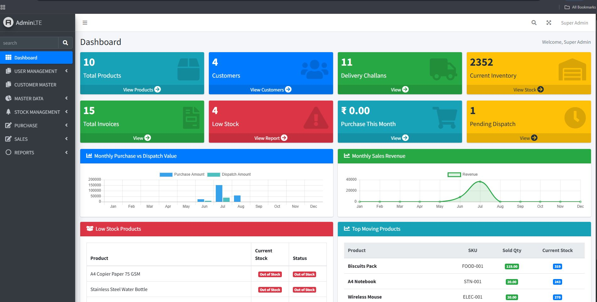
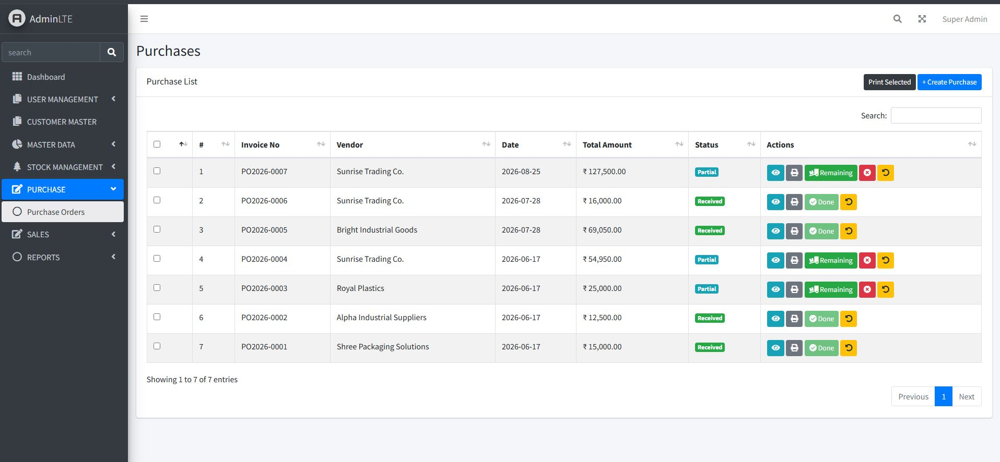
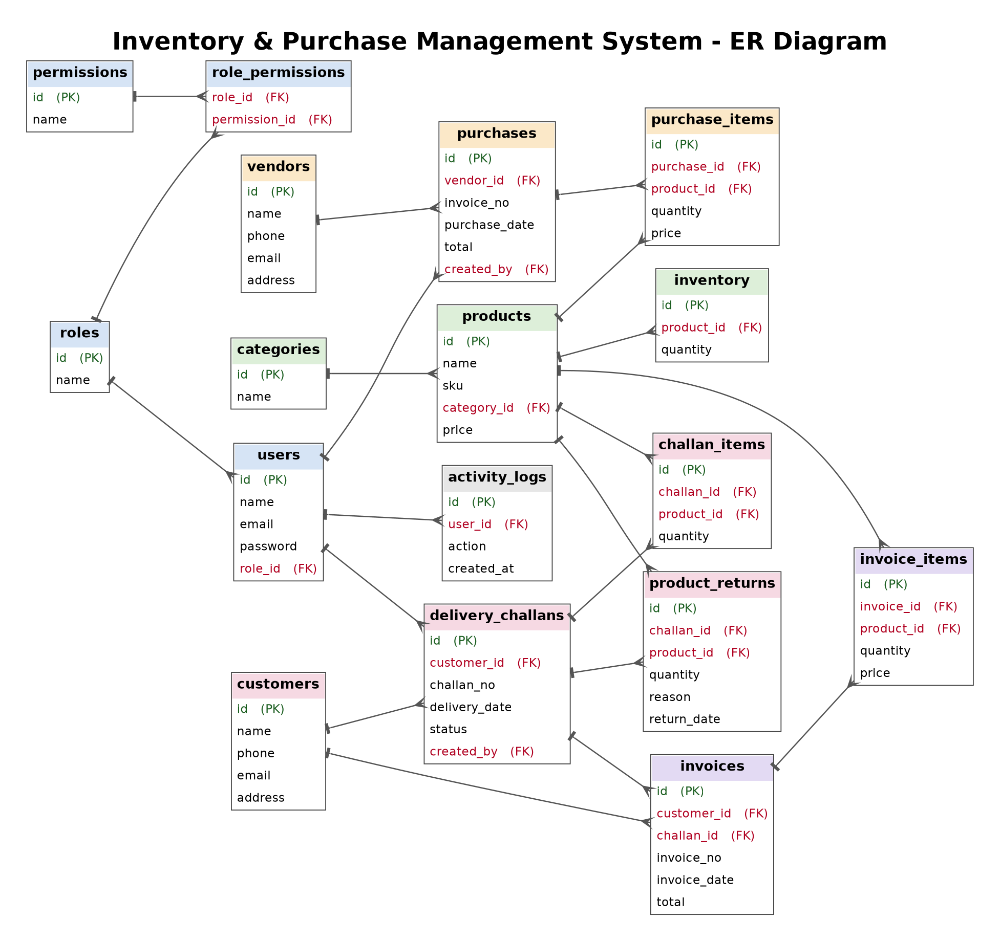

# Inventory & Purchase Management System

A Laravel web application that manages the full stock cycle of a business: purchase from vendors, stock tracking, delivery and dispatch to customers, invoicing and returns, with role-based access and reports in one dashboard.

## Screenshots

| Dashboard | Purchase Entry |
|---|---|
|  |  |

| Delivery Challan | Challan View |
|---|---|
|  |  |

| Ledger Report |
|---|
|  |

## Workflow

```
Vendor ──► Purchase ──► Stock In ──► Inventory ──► Dispatch / Challan ──► Invoice ──► Customer
                                         ▲                 │
                                         └──── Return ◄────┘
```

1. **Purchase:** record items bought from a vendor.
2. **Stock in:** purchased quantities are added to product stock.
3. **Dispatch / Delivery:** challans send products to customers and reduce stock.
4. **Invoice:** generate invoices for dispatched goods.
5. **Return:** returned products go back into stock.
6. **Reports:** purchase, inventory and delivery history.

## Modules

| Module | What it covers |
|---|---|
| **Master data** | Employees, roles & permissions, categories, products, vendors |
| **Customers (ERP)** | Customer records linked to dispatches and invoices |
| **Purchase** | Purchase entry, vendor-wise records, purchase tracking |
| **Inventory** | Stock-in, live stock per product, inventory reports |
| **Dispatch & Delivery** | Delivery challans, dispatch records, product returns |
| **Invoice** | Invoice generation for deliveries |
| **Reports** | Purchase, inventory, delivery and system reports |
| **System** | Dashboard analytics, activity logs, settings, login |

## Implemented features

**Access & security**
- Login with session handling and protected routes
- Role & permission management: create roles, assign permissions, assign roles to employees
- Activity log of user actions

**Master data**
- CRUD for employees, categories, products, vendors and customers
- Search / filter / pagination on list pages

**Purchase**
- Purchase entry with multiple items per purchase
- Vendor-wise purchase records and tracking

**Inventory**
- Stock-in against purchases
- Live stock per product and inventory reports

**Dispatch & delivery**
- Delivery challan creation with item selection
- Dispatch records and challan view / print
- Product return handling

**Invoicing**
- Invoice generation from dispatched goods
- Customer ledger / ledger report

**Reports & dashboard**
- Purchase, inventory, delivery and ledger reports
- Dashboard with summary counts
- Export / print options (PDF, Excel) *(only if implemented)*
- 
## Technical highlights

- **Modular routing:** one route file per domain (`auth`, `master`, `purchase`, `inventory`, `delivery`, `reports`, `system`) instead of one large `web.php`
- **Role-based access:** roles and permissions decide which modules and actions each employee can use
- **MVC structure:** controllers for requests, Eloquent models for data, Blade views for the UI (AdminLTE)
- **Relational database:** products, vendors, customers, purchases, deliveries and invoices are linked with foreign keys

## Tech stack

| Layer | Technology |
|---|---|
| Backend | Laravel, PHP |
| Database | MySQL |
| Frontend | Blade, AdminLTE, Bootstrap / Tailwind CSS, JavaScript |
| Build tool | Vite |

## Database design



## Getting started

**Requirements:** PHP 8.2+, Composer, Node.js, MySQL

```bash
git clone https://github.com/manasi2810/Inventory-Management.git
cd Inventory-Management

composer install
npm install && npm run build

cp .env.example .env
php artisan key:generate
```

Create a MySQL database and set `DB_DATABASE`, `DB_USERNAME` and `DB_PASSWORD` in `.env`, then:

```bash
php artisan migrate --seed
php artisan serve
```


## Project structure

```text
app/            Controllers, models, services
database/       Migrations and seeders
resources/      Blade views
routes/
├── auth.php        Login and session
├── master.php      Employees, roles, products, vendors
├── purchase.php    Purchase entry and records
├── inventory.php   Stock-in and inventory
├── delivery.php    Challans, dispatch and returns
├── reports.php     Reports
└── system.php      Dashboard, logs, settings
```

## Roadmap

- [ ] Database transactions around purchase, dispatch and return saves
- [ ] Stock movement history per product
- [ ] Low-stock alerts
- [ ] PDF / Excel export for reports and invoices 

## Author

**Mansi Nikam**, Laravel Developer
[GitHub](https://github.com/manasi2810) · [LinkedIn](https://linkedin.com/in/mansi-nikam-25b833259)
